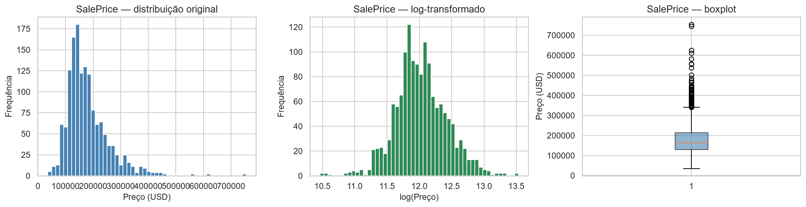
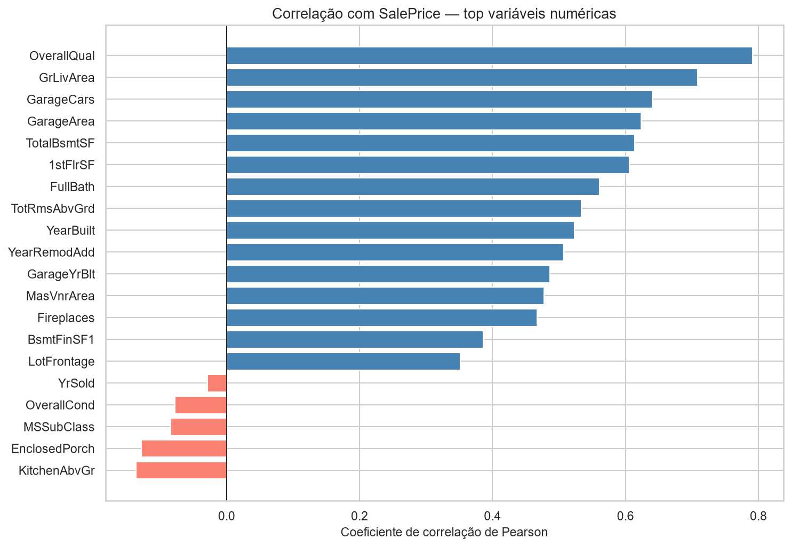
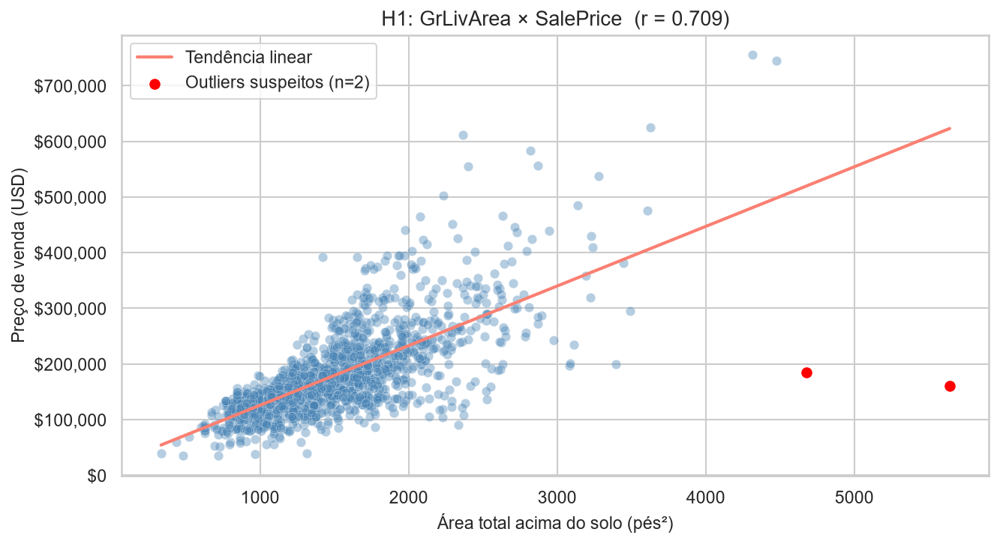
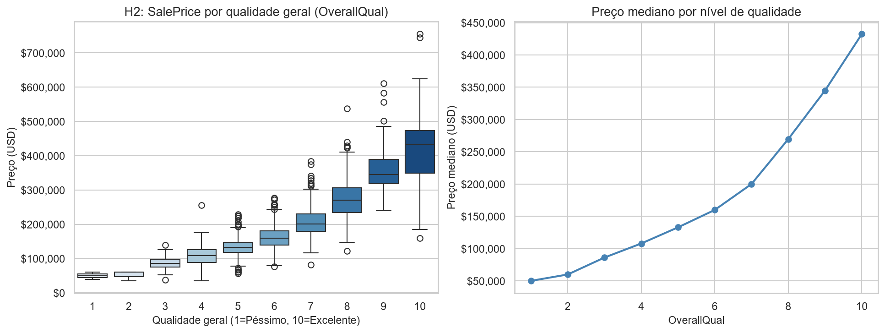
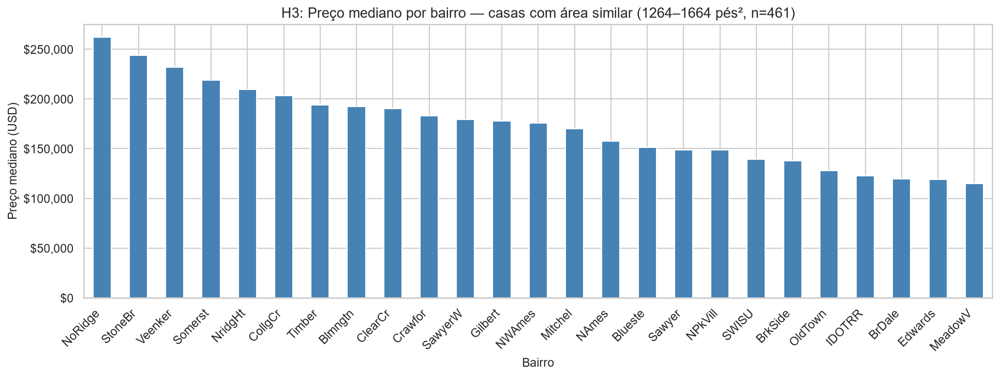
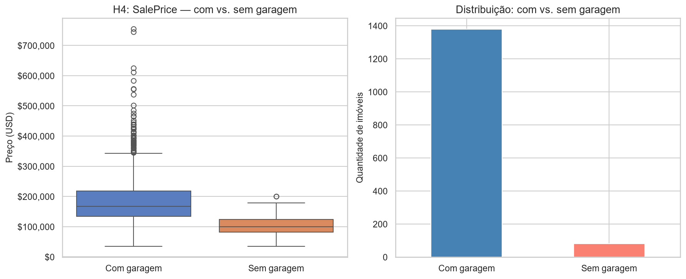
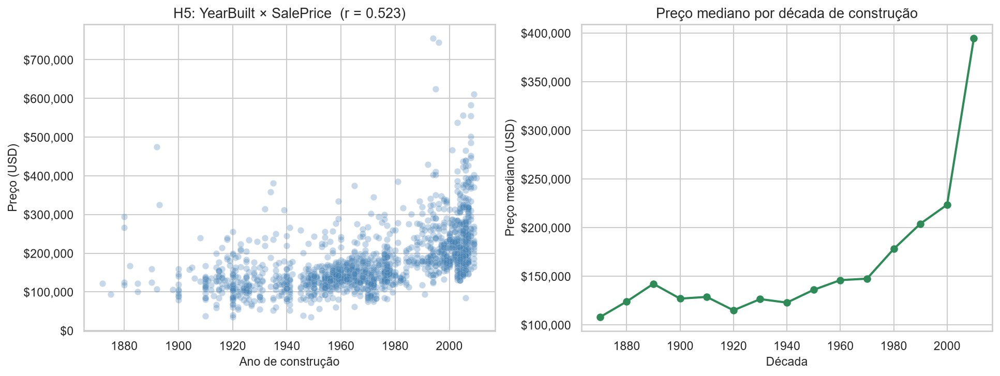
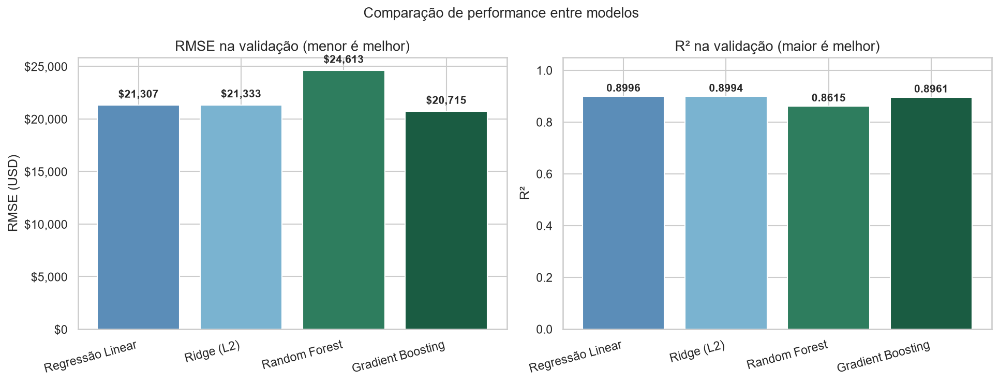
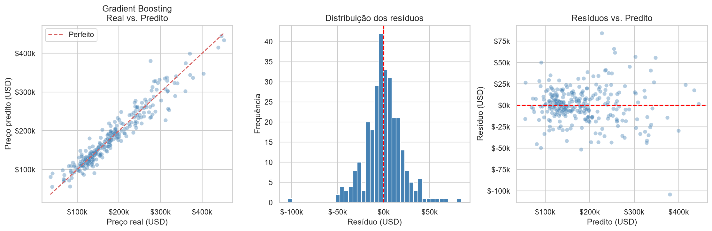
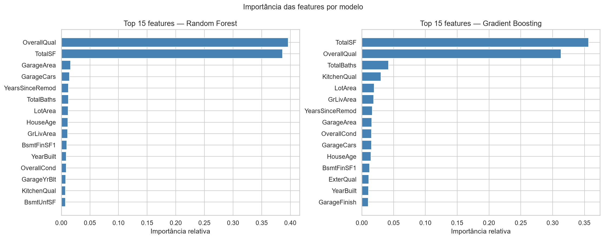

# Previsão de Preços de Imóveis Residenciais com Aprendizado de Máquina

**Um Estudo Comparativo entre Regressão Linear, Random Forest e Gradient Boosting Aplicado ao Dataset Ames Housing**

---

**Autores:** Emerson Rosado Scalcon e Leandro Trevisan Martins
**Disciplina:** Data Science
**Curso:** Ciência da Computação
**Instituição:** Universidade de Passo Fundo (UPF)
**Data:** Junho de 2026

**Repositório GitHub:** https://github.com/emersonscc/house-prices-ds

---

## 1. Introdução

A precificação de imóveis residenciais é um problema de relevância econômica e social significativa. Para o comprador, identificar imóveis cujo preço esteja alinhado às suas características objetivas pode evitar pagamentos acima do valor de mercado. Para o vendedor, definir um preço de oferta competitivo é determinante para o tempo de venda. Para corretoras, instituições financeiras e seguradoras, a precificação automatizada é insumo crítico para análise de risco, concessão de crédito e avaliação patrimonial. Tradicionalmente, essa precificação é feita por avaliadores humanos com base em comparações e experiência. No entanto, a disponibilidade de bases de dados estruturadas com centenas de atributos por imóvel abre espaço para abordagens estatísticas e de aprendizado de máquina capazes de capturar padrões complexos que escapam à inspeção manual.

Este projeto aborda esse problema utilizando o dataset *House Prices: Advanced Regression Techniques*, disponibilizado pela plataforma Kaggle e referente a transações imobiliárias no município de Ames, Iowa (EUA). O objetivo é desenvolver e comparar diferentes modelos de regressão capazes de prever o preço de venda (`SalePrice`) de um imóvel a partir de 79 variáveis explicativas, incluindo área construída, ano de construção, qualidade dos materiais, características da garagem, condições do porão e localização (bairro).

O trabalho foi guiado por cinco hipóteses iniciais, formuladas a partir do conhecimento de domínio sobre o mercado imobiliário. Cada hipótese foi testada estatisticamente na fase de análise exploratória e suas conclusões orientaram as decisões de pré-processamento e modelagem:

1. **H1** — A área habitável (`GrLivArea`) é o fator de maior correlação individual com o preço.
2. **H2** — A qualidade geral do imóvel (`OverallQual`) tem impacto não-linear sobre o preço, com prêmio desproporcional para imóveis de qualidade superior.
3. **H3** — O bairro (`Neighborhood`) explica variações de preço mesmo entre imóveis de tamanho similar.
4. **H4** — A ausência de garagem está associada a preços sistematicamente menores.
5. **H5** — Imóveis mais novos tendem a apresentar preços maiores.

Além dessas questões substantivas, o projeto buscou demonstrar a aplicação prática do ciclo completo de Data Science: definição do problema, análise exploratória, pré-processamento e engenharia de variáveis, modelagem comparativa, avaliação crítica de resultados e comunicação por meio de relatório técnico e dashboard interativo.

---

## 2. Dataset

### 2.1. Origem e características

O dataset utilizado é o *Ames Housing*, compilado por Dean De Cock (Truman State University) em 2011 como alternativa ao tradicional *Boston Housing*. Os dados foram obtidos diretamente do Cidade de Ames, Iowa, e descrevem 1.460 transações imobiliárias residenciais ocorridas entre 2006 e 2010. Cada observação possui 79 variáveis explicativas e uma variável-alvo (`SalePrice`), totalizando 81 colunas. O dataset é disponibilizado publicamente pela competição *House Prices: Advanced Regression Techniques* na plataforma Kaggle.

### 2.2. Dicionário de variáveis (principais)

A tabela abaixo apresenta as variáveis de maior relevância no estudo. O dicionário completo está disponível no arquivo `data_description.txt` do repositório.

| Variável | Tipo | Descrição |
|---|---|---|
| `SalePrice` | Numérica | Preço de venda do imóvel em USD (variável-alvo) |
| `OverallQual` | Ordinal (1-10) | Qualidade geral dos materiais e acabamento |
| `OverallCond` | Ordinal (1-10) | Condição geral do imóvel |
| `GrLivArea` | Numérica | Área habitável acima do solo (pés²) |
| `TotalBsmtSF` | Numérica | Área total do porão (pés²) |
| `GarageCars` | Numérica | Capacidade da garagem (número de veículos) |
| `GarageArea` | Numérica | Área da garagem (pés²) |
| `YearBuilt` | Numérica | Ano de construção original |
| `YearRemodAdd` | Numérica | Ano da última remodelação |
| `FullBath` | Numérica | Número de banheiros completos |
| `Neighborhood` | Categórica | Bairro (25 categorias) |
| `MSZoning` | Categórica | Classificação de zoneamento |
| `LotArea` | Numérica | Área do terreno (pés²) |
| `KitchenQual` | Ordinal | Qualidade da cozinha (Po a Ex) |
| `ExterQual` | Ordinal | Qualidade do acabamento externo |

### 2.3. Etapas de limpeza, transformação e engenharia de features

O pré-processamento foi conduzido no notebook `02_preprocessing.ipynb` e seguiu as decisões orientadas pela análise exploratória.

**Remoção de outliers.** Foram removidas 2 observações identificadas na análise da hipótese H1: imóveis com área habitável superior a 4.000 pés² vendidos por menos de $200.000. Tais observações representam vendas atípicas (possivelmente institucionais ou em condições especiais) e sua presença distorceria as linhas de regressão.

**Tratamento de valores ausentes.** Foi adotada uma estratégia contextualizada, reconhecendo que no dataset *Ames* a maioria dos valores `NaN` não representa dados faltantes, mas sim ausência do atributo descrito. Foram excluídas quatro variáveis com mais de 50% de ausência (`PoolQC`, `MiscFeature`, `Alley`, `Fence`), por carecerem de informação útil para a maioria dos imóveis. Variáveis categóricas remanescentes foram preenchidas com a categoria `None` quando `NaN` indicava ausência (ex.: `GarageType`, `BsmtQual`, `FireplaceQu`), e variáveis numéricas correspondentes foram preenchidas com `0` (ex.: `GarageArea`, `TotalBsmtSF`). Para as demais variáveis, foi utilizada imputação por moda (categóricas) ou mediana (numéricas).

**Transformação da variável-alvo.** A variável `SalePrice` apresenta assimetria positiva significativa (*skewness* = 1,88), com cauda longa à direita refletindo a presença de imóveis de alto valor. Foi aplicada a transformação `log1p(SalePrice)`, reduzindo a assimetria para 0,12 e aproximando a distribuição da normalidade — condição relevante para o desempenho da regressão linear.

**Engenharia de features.** Foram criadas sete novas variáveis com base no conhecimento de domínio:

- `TotalSF` = `TotalBsmtSF + GrLivArea` (área total da construção)
- `TotalBaths` = `FullBath + BsmtFullBath + 0,5 × (HalfBath + BsmtHalfBath)` (banheiros ponderados)
- `HouseAge` = `YrSold - YearBuilt` (idade do imóvel na venda)
- `YearsSinceRemod` = `YrSold - YearRemodAdd` (anos desde a última reforma)
- `HasGarage` = indicador binário de garagem
- `HasBasement` = indicador binário de porão
- `TotalPorchSF` = soma das áreas de varanda (aberta, fechada, três estações e tela)

A feature `TotalSF` se destacou ao atingir correlação de 0,82 com `SalePrice`, superando todas as variáveis originais — incluindo `GrLivArea` (0,71) e `OverallQual` (0,79).

**Codificação de variáveis categóricas.** Para variáveis ordinais relacionadas à qualidade (`ExterQual`, `KitchenQual`, `BsmtQual` etc.), foi aplicado mapeamento manual preservando a ordem semântica (`None=0, Po=1, Fa=2, TA=3, Gd=4, Ex=5`). Para variáveis nominais com até 10 categorias, foi aplicado One-Hot Encoding com `drop_first=True`. Variáveis nominais de alta cardinalidade (acima de 10 categorias) foram excluídas para reduzir a dimensionalidade.

**Normalização.** Foi aplicado `StandardScaler` (média 0, desvio padrão 1) para padronizar as escalas das variáveis numéricas, condição importante para a regressão linear e regressão Ridge. O `fit` do scaler foi feito exclusivamente no conjunto de treino para evitar *data leakage*, sendo apenas `transform` aplicado ao conjunto de validação.

**Divisão treino/validação.** A base foi dividida em 80% para treino (1.166 amostras) e 20% para validação (292 amostras), com `random_state=42` para garantir reprodutibilidade. O conjunto final possui 56 variáveis preditoras.

---

## 3. Análise Exploratória

### 3.1. Distribuição da variável-alvo

A análise inicial do `SalePrice` revelou uma distribuição fortemente assimétrica à direita (Figura 1). A mediana ($163.000) é significativamente inferior à média ($180.921), e a cauda longa estende-se até $755.000. A transformação logarítmica aplicada no pré-processamento corrigiu essa assimetria, tornando a distribuição aproximadamente normal e adequada para modelos lineares.

### 3.2. Correlações com a variável-alvo

A análise de correlação de Pearson entre as 38 variáveis numéricas e o `SalePrice` identificou que `OverallQual` (r = 0,79) e `GrLivArea` (r = 0,71) são os preditores mais fortes (Figura 2). Esse resultado reverte parcialmente a hipótese H1: a qualidade percebida supera o tamanho físico como variável explicativa individual mais relevante. Em terceiro e quarto lugar aparecem `GarageCars` e `GarageArea`, antecipando a confirmação de H4.

### 3.3. Teste das hipóteses

**H1 — Área habitável (GrLivArea).** A relação é forte e positiva, mas duas observações destoam claramente do padrão (Figura 3): imóveis com área superior a 4.500 pés² vendidos por menos de $200.000. Tratam-se de outliers removidos no pré-processamento. A correlação observada foi r = 0,709, confirmando a hipótese em termos de força, mas com a ressalva de que `OverallQual` apresenta correlação superior.

**H2 — Qualidade geral (OverallQual).** O boxplot por nível de qualidade (Figura 4) revela claramente o efeito não-linear: enquanto a transição da qualidade 5 para 6 representa aumento mediano de $40.000, a transição de 9 para 10 representa aumento superior a $80.000. O gráfico de mediana à direita confirma o padrão exponencial. Esta descoberta é particularmente importante para a modelagem, pois indica que modelos lineares enfrentarão limitação nesta variável, beneficiando os modelos baseados em árvores.

**H3 — Bairro.** Para isolar o efeito do bairro do efeito do tamanho, foram analisadas apenas casas com área entre 1.264 e 1.664 pés² (n = 461). O preço mediano variou de $115.000 (MeadowV) a $265.000 (NoRidge), uma variação de 2,3 vezes (Figura 5). A hipótese é claramente confirmada: localização explica variações substanciais de preço independentemente do tamanho.

**H4 — Garagem.** A diferença entre imóveis com e sem garagem foi expressiva: mediana de $175.000 para os primeiros contra $105.000 para os segundos, diferença de aproximadamente 67% (Figura 6). Vale notar que apenas 81 dos 1.460 imóveis (5,5%) não possuem garagem, o que torna essa categoria minoritária mas com impacto claro no preço.

**H5 — Ano de construção.** A correlação entre `YearBuilt` e `SalePrice` foi de 0,52 (Figura 7), indicando associação moderada. A análise por década evidencia uma valorização acentuada para imóveis construídos a partir dos anos 2000, sugerindo que critérios construtivos modernos e a presença de tecnologias atuais agregam valor além da idade isoladamente.

### 3.4. Síntese da análise exploratória

A EDA permitiu identificar padrões consistentes, validar parcialmente quatro das cinco hipóteses e ajustar a interpretação da quinta. Mais importante, gerou três decisões metodológicas para a modelagem: (i) transformação logarítmica da variável-alvo, (ii) remoção dos dois outliers de `GrLivArea` e (iii) priorização da feature `OverallQual` no entendimento do problema. A análise também antecipou que modelos lineares teriam limitações por causa da relação exponencial de `OverallQual`, motivando a inclusão de modelos baseados em árvores na fase de modelagem.

---

## 4. Modelagem

### 4.1. Seleção dos modelos

Foram escolhidos quatro modelos representando três famílias distintas de algoritmos de regressão, com o objetivo de comparar abordagens lineares e não-lineares:

**Regressão Linear (OLS).** Modelo de referência (baseline) que assume relação linear entre as features e o alvo. É interpretável e computacionalmente simples. Sua inclusão permite quantificar o ganho real obtido com modelos mais complexos.

**Regressão Ridge (L2).** Variante da regressão linear com regularização L2 sobre os coeficientes (`alpha=10`). Foi incluída para verificar se a multicolinearidade entre features (esperada em datasets com muitas variáveis correlacionadas, como áreas e qualidades) afeta significativamente os resultados.

**Random Forest Regressor.** Ensemble de árvores de decisão treinadas em subconjuntos aleatórios dos dados (*bagging*). Robusto a outliers e capaz de capturar relações não-lineares e interações entre variáveis sem necessidade de transformações prévias. Configuração: `n_estimators=300`, `max_depth=15`, `min_samples_leaf=3`.

**Gradient Boosting Regressor.** Ensemble que constrói árvores sequencialmente, com cada nova árvore corrigindo os erros residuais das anteriores. Geralmente apresenta a melhor performance em datasets tabulares de tamanho médio. Configuração: `n_estimators=500`, `learning_rate=0.05`, `max_depth=4`, `subsample=0.8`. O parâmetro `subsample` introduz componente estocástico que atua como regularização implícita.

### 4.2. Protocolo de treinamento e validação

Todos os modelos foram treinados sobre o mesmo conjunto de treino normalizado (1.166 amostras, 56 features) tendo `log1p(SalePrice)` como variável-alvo. A avaliação foi realizada de três formas complementares:

1. **Conjunto de validação (holdout)** — 292 amostras separadas no início do pré-processamento, nunca utilizadas no treinamento.
2. **Validação cruzada (5-fold)** — aplicada exclusivamente sobre o treino, para verificar a estabilidade da performance.
3. **Inspeção dos resíduos** — análise gráfica da relação entre valores preditos e reais, e da distribuição dos resíduos, para detectar problemas sistemáticos.

As métricas adotadas foram **RMSE** (raiz do erro quadrático médio, em USD), **MAE** (erro absoluto médio, em USD) e **R²** (coeficiente de determinação). Para reporte ao usuário final, as predições foram revertidas para o espaço original via `expm1()`, permitindo interpretação direta dos erros em dólares.

---

## 5. Resultados e Discussão

### 5.1. Comparação geral entre modelos

A Tabela 1 sintetiza os resultados dos quatro modelos.

**Tabela 1 — Comparação de performance entre modelos**

| Modelo | RMSE Treino | RMSE Validação | MAE Validação | R² Treino | R² Validação | CV RMSE (log) |
|---|---|---|---|---|---|---|
| Regressão Linear | $21.551 | $21.307 | $15.490 | 0,9117 | 0,8996 | 0,1273 |
| Ridge (L2) | $21.559 | $21.333 | $15.523 | 0,9117 | 0,8994 | 0,1268 |
| Random Forest | $14.246 | $24.613 | $16.947 | 0,9672 | 0,8615 | 0,1405 |
| **Gradient Boosting** | **$5.867** | **$20.715** | **$14.918** | **0,9931** | **0,8961** | **0,1282** |

O **Gradient Boosting** apresentou o melhor desempenho no conjunto de validação, com RMSE de $20.715 e MAE de $14.918. Considerando que o preço médio dos imóveis é de aproximadamente $180.000, o erro absoluto médio representa cerca de 8% do valor de venda — patamar considerado adequado para aplicações de avaliação automatizada de imóveis.

### 5.2. Discussão crítica dos resultados

A análise comparativa revela quatro pontos relevantes que merecem aprofundamento:

**Diagnóstico de overfitting no Random Forest.** O caso do Random Forest exemplifica de maneira clara o problema de overfitting. O modelo apresentou RMSE de treino de apenas $14.246 (segundo melhor) mas o pior desempenho na validação ($24.613). Essa lacuna de aproximadamente $10.000 entre treino e validação indica que o modelo memorizou padrões específicos dos dados de treinamento que não generalizam para novos casos. A configuração utilizada (`max_depth=15`) permite árvores profundas demais, e mesmo `min_samples_leaf=3` não foi suficiente para conter o sobreajuste.

**Regularização implícita no Gradient Boosting.** Em contraste, o Gradient Boosting apresenta RMSE de treino ainda menor ($5.867) — sinal de capacidade de ajuste superior — mas generaliza melhor na validação ($20.715). A diferença está nos mecanismos de regularização: `learning_rate=0.05` força o modelo a aprender em passos pequenos, e `subsample=0.8` introduz aleatoriedade no treinamento de cada árvore. Esses elementos atuam como regularização implícita.

**Robustez da Regressão Linear.** A performance da Regressão Linear ($21.307 de RMSE) ficou apenas $592 acima do Gradient Boosting. Esse resultado surpreende positivamente e tem implicação prática importante: para muitos casos de uso, um modelo linear simples e interpretável pode ser preferível ao Gradient Boosting, pois oferece transparência (cada coeficiente é diretamente legível) ao custo de erro adicional inferior a 3% sobre o melhor modelo. O resultado também sugere que o feature engineering do pré-processamento — em particular a criação de `TotalSF` — capturou boa parte das não-linearidades, deixando às variáveis remanescentes um comportamento aproximadamente linear.

**Multicolinearidade não é problema crítico.** A Regressão Ridge produziu resultado virtualmente idêntico à Regressão Linear ($21.333 vs $21.307), indicando que a multicolinearidade entre features não está afetando significativamente a estabilidade dos coeficientes lineares. A regularização L2 não trouxe benefício mensurável neste cenário.

### 5.3. Análise de resíduos do melhor modelo

A inspeção dos resíduos do Gradient Boosting (Figura 9) confirma o comportamento adequado do modelo. O gráfico Real × Predito mostra alinhamento próximo da reta de identidade em toda a faixa de preços. A distribuição dos resíduos é aproximadamente simétrica e centrada em zero, sem indícios de viés sistemático. Existem alguns resíduos negativos expressivos na faixa de preços altos (acima de $300.000), indicando que o modelo subestima imóveis muito caros — comportamento esperado, dado que esta faixa está sub-representada nos dados de treinamento (cauda longa da distribuição).

### 5.4. Importância das features

A Figura 10 apresenta a importância das features para os dois modelos baseados em árvores. O resultado fecha o ciclo da análise iniciada na EDA de forma elegante.

No **Random Forest**, `OverallQual` lidera com aproximadamente 40% da importância total, confirmando definitivamente a relevância identificada na hipótese H2. No **Gradient Boosting**, `TotalSF` aparece em primeiro lugar com 35%, validando a engenharia de features realizada no pré-processamento — a variável criada superou todas as variáveis originais isoladas. Em ambos os modelos, apenas duas variáveis (`OverallQual` e `TotalSF`) respondem por aproximadamente 70% da importância total, indicando que o problema de precificação imobiliária no dataset *Ames* é dominado por dois fatores principais: qualidade percebida e área total construída.

---

## 6. Conclusão

Este trabalho desenvolveu um sistema de previsão de preços imobiliários, percorrendo todas as etapas do ciclo de Data Science aplicado ao dataset *Ames Housing*. A partir de cinco hipóteses iniciais sobre o mercado imobiliário, foram realizadas análise exploratória aprofundada, pré-processamento com engenharia de sete novas features, treinamento comparativo de quatro modelos de regressão e construção de dashboard interativo para comunicação dos resultados.

O modelo final escolhido — **Gradient Boosting Regressor** — atingiu RMSE de validação de $20.715 e MAE de $14.918, representando aproximadamente 8% do preço médio dos imóveis. As cinco hipóteses iniciais foram confirmadas (quatro plenamente e uma parcialmente), e a análise de importância das features revelou que o problema é dominado por dois fatores: qualidade percebida (`OverallQual`) e área total construída (`TotalSF`). A engenharia de features foi particularmente bem-sucedida — `TotalSF`, variável criada a partir da soma da área do porão e da área acima do solo, apresentou correlação superior a qualquer variável original (r = 0,82) e foi a feature mais importante para o modelo vencedor.

### 6.1. Limitações

O trabalho apresenta limitações que devem ser explicitadas. A primeira é a **especificidade geográfica e temporal** dos dados: o dataset cobre apenas o município de Ames, Iowa, entre 2006 e 2010. Os modelos treinados não devem ser generalizados para outros mercados ou períodos sem novo treinamento. A segunda é a **sub-representação de imóveis de alto valor**: a cauda direita da distribuição de preços contém poucas observações, o que limita a capacidade dos modelos de prever com precisão imóveis acima de $300.000. A terceira é a **ausência de variáveis macroeconômicas externas**, como taxa de juros, inflação imobiliária ou indicadores de desenvolvimento regional, que poderiam enriquecer o modelo. A quarta é a **adoção de configurações conservadoras de hiperparâmetros**, sem busca sistemática (grid search ou bayesiana), o que provavelmente deixa margem para melhoria marginal na performance.

### 6.2. Sugestões para trabalhos futuros

A partir das limitações identificadas, sugerem-se três direções para extensão do trabalho:

**Otimização de hiperparâmetros.** A aplicação de busca sistemática (`GridSearchCV` ou otimização bayesiana via Optuna) sobre o Gradient Boosting poderia reduzir o RMSE em margem relevante. A configuração conservadora atual privilegiou estabilidade sobre performance máxima.

**Stacking de modelos.** A combinação das predições dos quatro modelos via meta-aprendizado (modelo de segundo nível treinado sobre as predições) é uma técnica conhecida por reduzir o erro residual em datasets tabulares e seria uma extensão natural deste trabalho.

**Incorporação de dados externos.** A inclusão de variáveis macroeconômicas, como o índice nacional de preços imobiliários (FHFA House Price Index) e a taxa de juros hipotecária no período de cada venda, poderia capturar variações sistemáticas atribuíveis ao contexto econômico que escapam aos atributos físicos do imóvel.

---

## Referências

Cock, D. D. (2011). Ames, Iowa: Alternative to the Boston Housing Data as an End of Semester Regression Project. *Journal of Statistics Education*, 19(3).

Hastie, T., Tibshirani, R., & Friedman, J. (2009). *The Elements of Statistical Learning: Data Mining, Inference, and Prediction* (2nd ed.). Springer.

Pedregosa, F. et al. (2011). Scikit-learn: Machine Learning in Python. *Journal of Machine Learning Research*, 12, 2825-2830.

Kaggle. *House Prices: Advanced Regression Techniques*. Disponível em: https://www.kaggle.com/competitions/house-prices-advanced-regression-techniques. Acesso em: junho de 2026.
